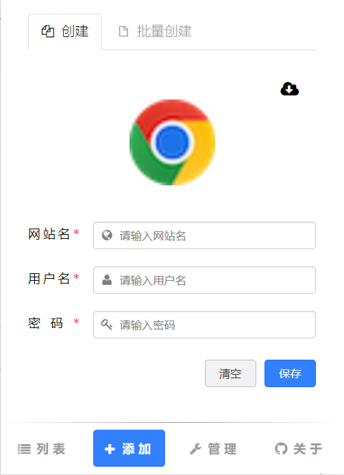
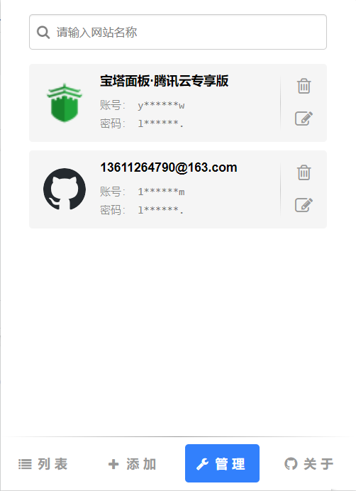
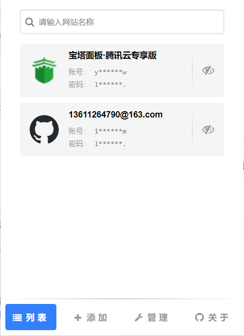

# logger

这是一个登录器管理工具，支持登录器的创建、管理、查询以及便捷登录。

## 创建

### 创建

输入 `网站名`, `用户名`, `密码` 点击保存即可创建登录器。

### 快捷创建

1. 切换至需要创建登录器的标签页
2. 点击 logger，选择 `添加` 菜单
3. 点击图标自动抓取当前网页的 `网站图标`和 `网站名`
4. 输入 `用户名`, `密码` 点击保存即可创建登录器。

## 管理

支持删除和修改登录器信息

## 登录

1. 切换至需要登录的标签页，选择使用账号/密码登录
2. 打开 logger，点击列表中的登录器自动输入账号密码
3. 点击登录

## 关于

待补充
